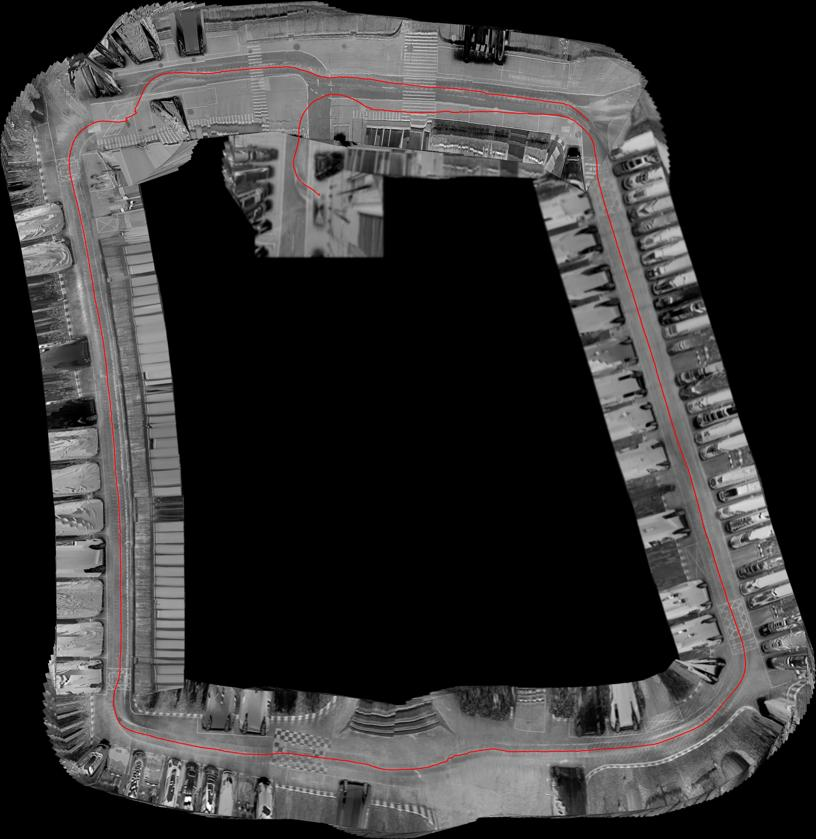

# Visual-Based-Odometry-Estimation-cpp

Used to reproduce the project [matlab_repo](https://github.com/cuixing158/Visual-Based-Odometry-Estimation2) into C++ code. The input and output results can ensure consistent execution results. Supported on platforms such as TI/Windows/Linux.

用于复现仓库[matlab_repo](https://github.com/cuixing158/Visual-Based-Odometry-Estimation2)的C++工程代码,输入输出结果可以保证达到一致的运行结果。支持在Ti/win/linux等平台运行。

## Requirements

Open C++ Library:

- OpenCV 3/4.x（Open Source Computer Vision Library）

Complier

- C++ Compiler (e.g., GCC, Clang, or MSVC)

## How to use

```bash
git clone --recurse-submodules https://github.com/cuixing158/Visual-Based-Odometry-Estimation-cpp.git
cd Visual-Based-Odometry-Estimation-cpp
mkdir build  
cd build
cmake ..
make
```

## Demonstration

Loop closure detection and optimization result：


