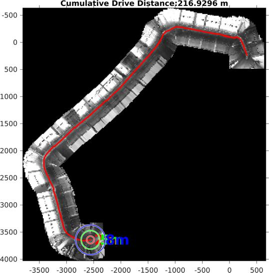
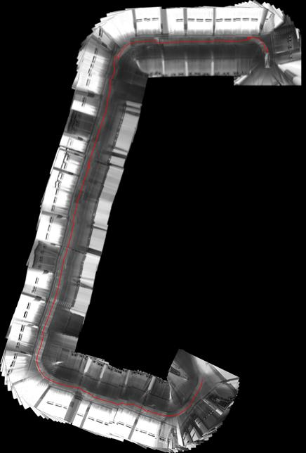
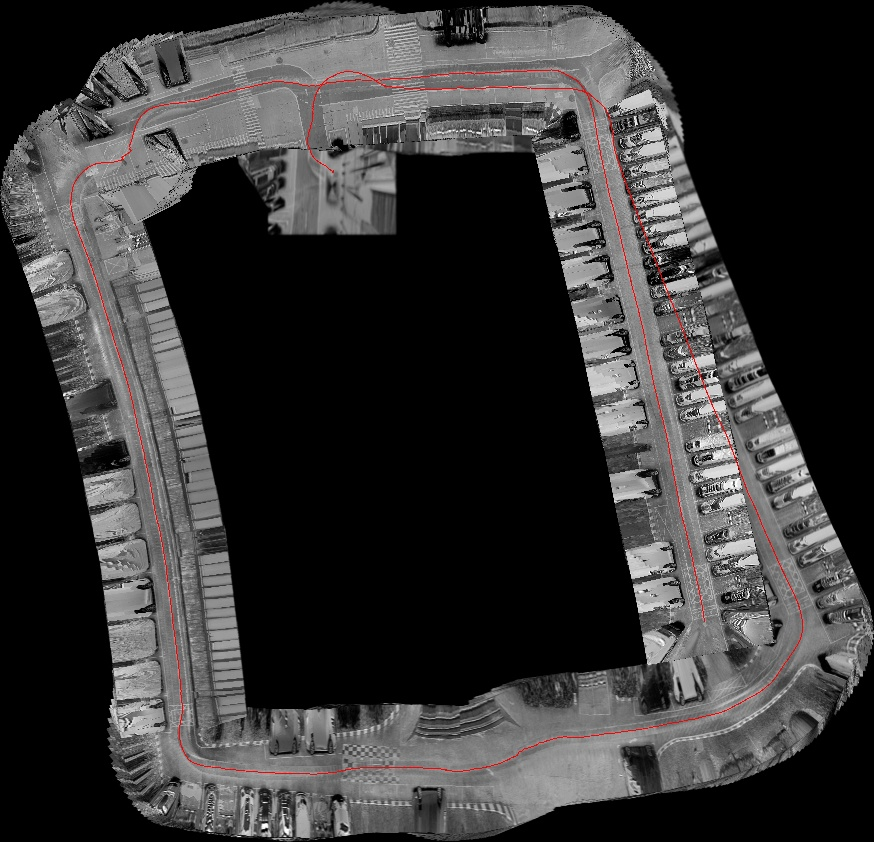
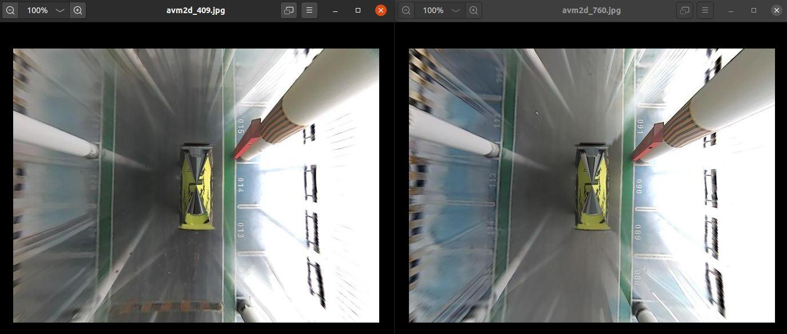

# 2D SLAM C++程序

[2023-07-11](date:"ymd") 崔星星首次记录

最新修改于[2023-08-16](date:"ymd")

>用于复现此项目分支[matlab_branch](http://autogit.long-horn.com:3000/algorithm_Dev/buildMapping)的C++工程代码,输入输出结果可以保证达到一致的运行结果。支持在Ti/win/linux等平台运行。

## Requirements

- OpenCV 3.x

- C++ 11 support compiler

无特定平台和编译器要求。

## 部署更新记录

- 2023.7.21 初始建图版本，速度较5月份快2倍，效果明显较好！

对于新的地下停车场数据集的一段约长217m建图对比如下：

<table style="border:0px">
   <tr>
       <td> 
        
以前仅建图无闭环
</td>
       <td> 
        
目前仅建图无闭环
</td>
   </tr>
</table>

对于我司园区地图没有回环优化的情况下，建图结果也近似“完美”(之前没有回环情况下偏差非常大，呈五边形)：
<table style="border:0px">
   <tr>
       <td> 
        
目前单次闭环优化前
</td>
       <td> 
        
目前单次闭环优化后
</td>
   </tr>
</table>

另外即使“建图”步骤良好的情况下，地面结构太相似(分数达到0.24)，容易造成错误的闭环检测，从而干扰姿态图优化，比如下面这对图像太相似造成闭环检测错误，**后果是严重影响后续HDmap构建**。

